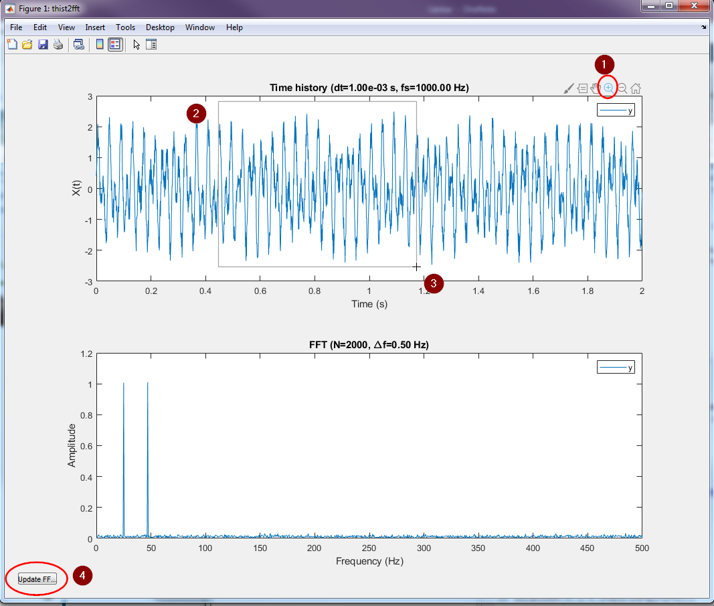
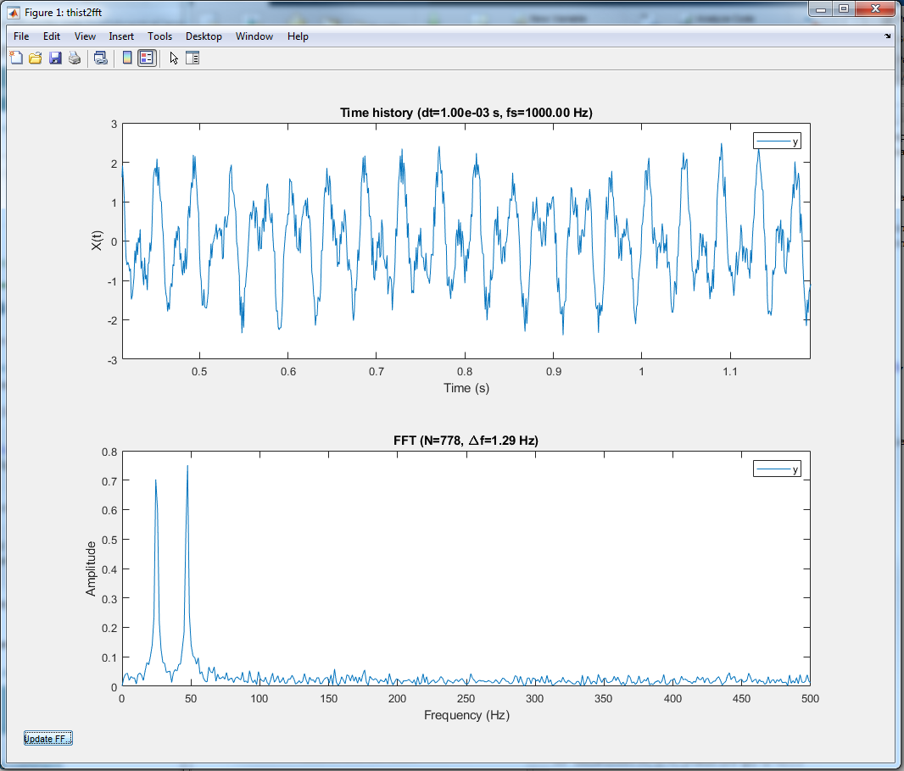
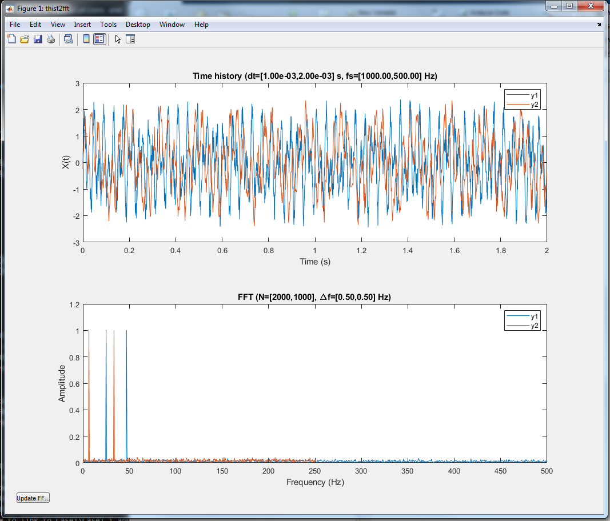
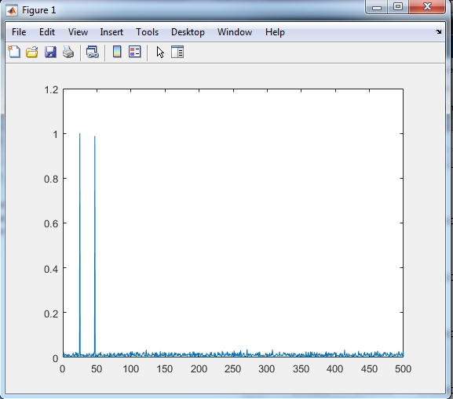
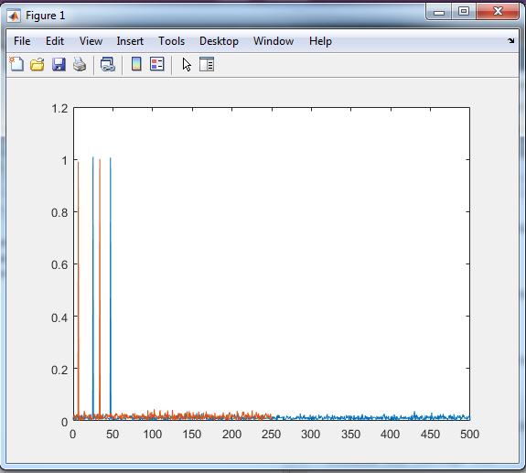

# thist2fft
A MATLAB-function to calculate the FFT for one or many time-history curves

[https://github.com/danneedebro/thist2fft](https://github.com/danneedebro/thist2fft)

## Example 1
```
fs=1000;
t=0:1/fs:2;
y=sin(2*pi*25*t)+sin(2*pi*47*t)+rand(size(t))-0.5;
thist2fft(t,y);
```

To narrow down the range to fft, zoom using the normal controls and press the button in the bottom left corner.





## Example 2 - multiple curves
```
fs=1000;
t1=0:1/fs:2;
t2=t1(1:2:end);
y1=sin(2*pi*25*t1)+sin(2*pi*47*t1)+rand(size(t1))-0.5;
y2=sin(2*pi*13*t2)+sin(2*pi*67*t2)+rand(size(t2))-0.5;
thist2fft(t1,y1,t2,y2);
```




## Example 3 - batch mode
To just return the frequency and amplitude vectors, use ```[f,amp]=thist2fft(t,y)```

```
fs=1000;
t=0:1/fs:2;
y=sin(2*pi*25*t)+sin(2*pi*47*t)+rand(size(t))-0.5;
[f,amp]=thist2fft(t,y);

plot(f,amp);
```




## Example 4 - batch mode, multiple curves
If multiple curves are given as arguments ```f``` and ```amp``` is returned a cell vectors.

```
fs=1000;
t1=0:1/fs:2;
t2=t1(1:2:end);
y1=sin(2*pi*25*t1)+sin(2*pi*47*t1)+rand(size(t1))-0.5;
y2=sin(2*pi*13*t2)+sin(2*pi*67*t2)+rand(size(t2))-0.5;
[f,amp]=thist2fft(t1,y1,t2,y2);

plot(f{1},amp{1},f{2},amp{2});
```

